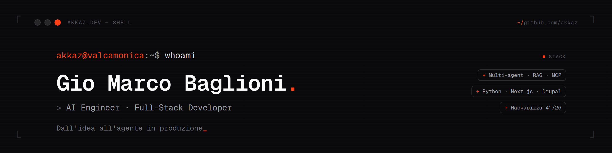

<!-- ┌─────────────────────────────────────────────────────────────┐ -->
<!--   akkaz · profile README · brand: coral #ff4017 / zinc-950     -->
<!-- └─────────────────────────────────────────────────────────────┘ -->

<div align="center">

<a href="https://akkaz.dev">
  
</a>

<br/><br/>

<a href="https://readme-typing-svg.demolab.com">
  
</a>

<br/>

<a href="https://akkaz.dev"></a>
<a href="https://www.linkedin.com/in/giomarcobaglioni"></a>
<a href="mailto:giomarco@cleversoft.it"></a>


</div>

---

```bash
akkaz@valcamonica:~$ cat ~/about.txt
```

> **AI Engineer & Full-Stack Developer** dalla Valle Camonica.
> Dopo **10+ anni** di sviluppo web sono andato all-in sull'AI: oggi progetto e porto
> in **produzione** agenti, sistemi multi-agente e pipeline RAG — dal prototipo al deploy.
>
> `+` **Soluzioni AI su misura** — agenti che ragionano, decidono e agiscono.
> `+` **Sviluppo web & software** — gestionali, app e portali (Next.js · Python · Drupal).
> `+` **Consulenza & formazione AI** — strategia, workshop e corsi pratici per team e aziende.
>
> Nessun vendor lock-in: scelgo la tecnologia giusta per il problema. Niente fuffa, solo codice che funziona.
> Su internet sono **akkaz** → parla con il mio agente su **[akkaz.dev](https://akkaz.dev)**.

---

### `~/ stack`

<p>
  
  
  
  
  
  
  
</p>
<p>
  
  
  
  
  
  
  
</p>

---

### `~/ work` — progetti in evidenza

<table>
<tr>
<td width="50%" valign="top">

**[AIportfolio](https://github.com/akkaz/AIportfolio)** &nbsp;
<br/>Portfolio con agente AI conversazionale (Vercel AI SDK · tool calling · MongoDB) → **[akkaz.dev](https://akkaz.dev)**

</td>
<td width="50%" valign="top">

**[tft-companion](https://github.com/akkaz/tft-companion)** &nbsp;
<br/>Calcolatore di probabilità + match tracker per TFT: modello di contestazione, import partite Riot.

</td>
</tr>
<tr>
<td width="50%" valign="top">

**[eu-funding-matcher](https://github.com/akkaz/eu-funding-matcher)** &nbsp;
<br/>Matching di bandi e finanziamenti europei su profilo aziendale.

</td>
<td width="50%" valign="top">

**[ccstatusline-gradient](https://github.com/akkaz/ccstatusline-gradient)** &nbsp; 
<br/>Status line per Claude Code con gradienti e colori dinamici.

</td>
</tr>
</table>

> **Progetti reali (codice privato/aziendale)** &nbsp;`+` **OnePAC** — gestionale enterprise per cantieri, Drupal 11 · PWA &nbsp;`+` **in-fly** — gestionale di produzione per meccanica di precisione aerospace, PWA a bordo macchina &nbsp;`+` sistema di supervisione **multi-agente** per Forma Aquae &nbsp;`+` consulenza AI per la formazione medica &nbsp;`+` **9 agenti AI** ad Hackapizza 2.0 (4&deg;/26 team).

---

### `~/ stats`

<div align="center">


<br/>


</div>

---

### `~/ certs`

`+` **Claude Code in Action** · Anthropic &nbsp;·&nbsp; `+` **Introduction to Agent Skills** · Anthropic &nbsp;·&nbsp; `+` in corso: **Claude Certified Architect — Foundations**

---

<!-- snake contribution animation (generato dalla GitHub Action sul branch output) -->
<div align="center">

<picture>
  <source media="(prefers-color-scheme: dark)" srcset="https://raw.githubusercontent.com/akkaz/akkaz/output/snake-dark.svg" />
  
</picture>

<br/><br/>

<sub><code>akkaz@valcamonica:~$</code> <b>Costruiamo qualcosa insieme</b> → <a href="https://akkaz.dev">akkaz.dev</a><span style="color:#ff4017">_</span></sub>

</div>
